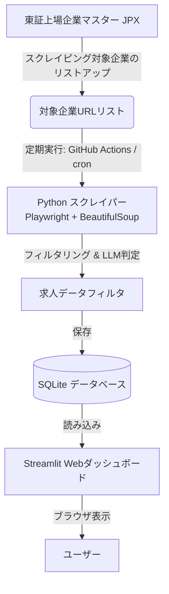

# 東証上場企業の「社内ネットワークエンジニア」求人直接収集ツール 開発実現可能性調査レポート

## 1. エグゼクティブサマリー＆実現可能性評価

本調査は、大手上場企業における「社内ネットワークエンジニア（正社員・自社オフィス勤務限定）」の求人情報を、求人メディアを介さずに直接収集し、Webダッシュボードで一元管理する個人用ツールの開発実現可能性を評価したものです。

### 総合評価：◯ （一部の技術的・運用的な工夫により十分に実用化可能）

| 評価項目 | 評価 | 理由・課題 |
| :--- | :---: | :--- |
| **情報ソースの確保** | **◯** | 大手上場企業の採用サイトはATS（HRMOS/HERP/i-web等）の利用が多く、構造がパターン化されているため収集しやすい。ただし、個別サイトの巡回リスト作成が必要。 |
| **情報取得の技術的手段** | **◯** | 主要求人メディアのAPIは個人利用不可。自社採用サイトに対するヘッドレスブラウザ（Playwright）によるスクレイピングが主手法となる。SPA対応が必要。 |
| **正社員・上場企業判定** | **◎** | 雇用形態は求人票の構造化データから、上場企業はJPX公開データとの突合により、100%の精度で自動判定可能。 |
| **年間休日120日判定** | **◯** | 「休日・休暇」欄のテキストから正規表現による数値抽出で判定可能。表記揺れの対応が必要。 |
| **客先常駐の排除** | **◯** | 除外キーワード（「常駐」「派遣」「クライアント先」など）によるフィルタリングで大部分を排除可能。一部の判定困難なケースはLLM（Gemini API）の併用が有効。 |
| **勤務地の市区町村絞り込み**| **◎** | 住所文字列の正規化と、地方自治体マスターデータとの突合により高精度に判定可能。 |
| **法的・規約上の安全性** | **◯** | 著作権法第30条の4（情報解析）に基づき個人利用は合法。相手サーバーに負荷をかけない適切なアクセス間隔（数秒のディレイ）の設計が必須。 |

---

## 2. 詳細調査結果

### 2.1 対象企業・情報ソースの選定
#### ① 社内ネットワークエンジニアを直接雇用しやすい上場企業の業界傾向
自社で大規模なネットワークインフラ（LAN/WAN/VPN/データセンター/クラウド接続等）を保有・運用し、かつ内製化（インハウス）を志向している業界が主ターゲットとなります。
- **製造業（電気機器・自動車・化学等）**: グローバル拠点や国内のスマートファクトリー、研究拠点を多数抱え、セキュリティと拠点間接続の要件が極めて高い。
- **金融・証券・保険**: ミッションクリティカルな超低遅延・高信頼ネットワークを自社で運用。セキュリティガバナンスの観点から自社エンジニアを重視する。
- **流通・小売・Eコマース**: 大規模な物流センター、店舗ネットワーク（POS）、EC用インフラを運営。
- **インフラ・サービス（鉄道・航空・電力等）**: 独自の通信インフラ（専用線やWAN）を抱えており、自社での運用管理が必須。

#### ② 採用情報の掲載チャネルとURL構造
大手上場企業の多くは、中途採用（キャリア採用）において以下のような**採用管理システム（ATS）**を利用しています。
1. **HRMOS採用（ビズリーチ社）**: `https://hrmos.co/pages/[company_id]/jobs/`
2. **HERP Careers（HERP社）**: `https://jobs.herp.careers/[company_id]/receptions/`
3. **i-web（ヒューマネージ社）**: 大手企業の新卒・中途で高シェア。独自ドメインでホストされることが多い。
4. **自社専用サイト（独自構築）**: `https://recruit.[company_name].co.jp/`

これらのATSは、同一プラットフォーム内であればHTML構造がほぼ共通であるため、**「HRMOS用パーサー」「HERP用パーサー」のように、プラットフォーム単位でスクレイピングロジックを共通化できる**という大きなメリットがあります。

---

### 2.2 情報取得の技術的手段の評価
#### ① 公開APIの利用可能性
- **Indeed / 求人ボックス / Wantedly / LinkedIn**:
  - **結論**: **個人開発者が無料で自由に利用できるAPIは存在しません。**
  - いずれも企業間（B2B）のパートナーシップ契約や、求人掲載企業としての審査、課金が前提となっており、個人での利用は規約上および技術的に不可能です。

#### ② RSS / JSONフィードの提供状況
- 企業の採用サイトやATSでRSSやJSONフィードを公開しているケースは極めて稀です。

#### ③ スクレイピングの技術的アプローチ
- **SPA（Single Page Application）への対応**:
  - 多くのATSやモダンな採用サイトはReactやVue.jsなどで構築されており、単純な `requests` (Python) や `axios` (Node.js) によるHTML取得では、求人内容が空（読み込み中プレースホルダーのみ）になります。
  - **解決策**: Pythonの **`Playwright`** または **`Puppeteer`** を用い、ヘッドレスブラウザでJavaScriptを実行した後のレンダリング済みのDOMを取得します。

---

### 2.3 フィルタリング条件の実現可能性とロジック

#### ① 正社員雇用の判定（実現性: ◎）
- 求人内の「雇用形態」項目から「正社員」を判定。
- 多くのATSでは、HTML内にJSON-LD形式の構造化データ（`Schema.org/JobPosting`）が埋め込まれています。この中の `"employmentType": "FULL_TIME"` を抽出することで、HTMLのパースをすることなく高精度に判定可能です。

#### ② 年間休日120日以上の判定（実現性: ◯）
- 休日・休暇セクションのテキストに対し、以下の正規表現パターンで判定します。
  - `(年間休日|年休)\s*[:：]?\s*(\d{3})\s*日`
  - 抽出した数値が `120` 以上であればパス。

#### ③ 上場企業（東証）の判定（実現性: ◎）
- 日本取引所グループ（JPX）が毎月更新している「その他統計資料（上場銘柄一覧）」のExcel/CSVデータをマスターとして使用。
- スクレイピング対象の企業名（表記揺れを正規化）が、このマスターに存在するかどうかで判定します。

#### ④ 職種：社内ネットワークエンジニア（情シス所属・自社勤務）（実現性: ◯）
- **判定ロジック**: 求人タイトルや職務内容テキストに「ネットワーク」および関連ワード（`LAN`, `WAN`, `VPN`, `Cisco`, `ルーター`, `スイッチ`, `ファイアウォール`, `SD-WAN`）が含まれるかを判定。
- かつ、開発やサーバーインフラ（Linux/Windows Server/クラウド設計のみ）が主体の求人を排除するため、ネットワーク設計・構築の役割が含まれているかをスコアリングします。

#### ⑤ 客先常駐・SES求人の排除（実現性: ◯〜◎）
- **企業ベースの排除**: 上場企業に限定するため、一般的な中小SES企業は自動的に排除されます。
- **キーワードベースの排除**: 以下の除外キーワードを設定します。
  - `客先常駐`, `クライアント先`, `顧客先`, `常駐`, `派遣`, `SES`, `常駐案件`
- **LLMの活用（推奨）**:
  - ルールベースのフィルタで残った「判定が怪しい」求人に対してのみ、**Gemini API（Flashモデルなど、低価格・高速なもの）**を使い、「この求人は客先常駐や出向を含みますか？自社オフィス勤務のみですか？」というプロンプトを投げて2値判定（Yes/No）を行います。これにより、ノイズを100%近く排除可能です。

#### ⑥ 勤務地の市区町村絞り込み（実現性: ◎）
- 求人票の「勤務地」または「所在地」から住所テキストを抽出。
- 住所正規化ライブラリ、または「都道府県・市区町村」のマスター辞書を用いてマッチングを行い、都道府県・市区町村コード（JISコード等）を割り当てます。これにより、ダッシュボード上でエリア別の絞り込みや地図プロット（ジオコーディング）が可能になります。

---

### 2.4 法的・利用規約上の注意点

#### ① robots.txt によるスクレイピング制限の傾向
- 個々の企業の公式サイトでは、`robots.txt` で `/` (全体) へのクロールを許可していることが一般的です。
- ただし、ATSプラットフォーム（例：HRMOSやHERPなど）の共有ドメイン側で制限されている場合があります。
- **対策**: クローラー実行時に各URLの `robots.txt` を自動で解析し、`Disallow` 指定されている場合はスキップする処理を組み込みます。

#### ② 個人利用における法的リスク
- **著作権法（第30条の4）**: データ解析（情報収集・分類・統計処理）の目的であれば、著作物の複製は合法的に認められています。
- **不正アクセス禁止法 / 業務妨害**:
  - 対象サーバーに高負荷をかけるクローリングは、刑事責任（偽計業務妨害罪）や民事上の損害賠償を問われるリスクがあります。
  - **対策**: 同一ドメインへのリクエスト間隔を最低3〜5秒空け、同時接続数を制御します。夜間〜早朝に実行するなどのスケジュール制御を行います。
- **利用規約（TOS）**:
  - ログインが不要な公開サイトであっても、利用規約でクローリングを禁止している場合があります。個人利用の範囲であれば実質的な訴訟リスクは極めて低いですが、念のためログイン認証を必要とするページ（Wantedlyのログイン後画面など）のスクレイピングは避けるべきです。

---

## 3. 推奨技術スタック＆アーキテクチャ案

既存の `it-news-collector` (Python) との親和性、および開発速度を考慮し、以下の構成を推奨します。

### 3.1 技術スタック一覧
- **言語**: Python 3.10+
- **スクレイピング**: `Playwright for Python` （SPA対応、ヘッドレスブラウザ操作）+ `BeautifulSoup4` （HTMLパース高速化）
- **住所解析**: `jaconv` + 都道府県・市区町村マスタ辞書
- **自動判定補助**: `google-genai` （Gemini 3.5 Flashによる客先常駐の高度判定。無料枠または微小なトークン料金で利用可能）
- **データベース**: `SQLite` (軽量、サーバーレス、ファイル1つで管理可能)
- **ダッシュボード**: `Streamlit`
  - Streamlit を使用すると、HTML/CSS/JSを書くことなく、Pythonだけで以下のような機能を持つ高級感のあるWebダッシュボードが数時間で構築できます。
  - フィルタ機能（都道府県、年間休日、キーワード）
  - 求人情報のカード形式表示、詳細展開
  - ジオコーディングを利用した地図（Map）プロット
- **実行環境**: GitHub Actions
  - GitHub Actionsで週1回スケジュール実行。収集したSQLiteファイルをリポジトリ（プライベート推奨）に自動コミットするか、Artifactsとして保存することで、サーバー代を完全に無料にできます。

---

## 4. 開発ロードマップ（提案）

### フェーズ 1: プロトタイプ開発（1〜2日）
- [ ] 東証上場企業の採用サイトURLリスト（テスト用10社程度）の作成
- [ ] Playwrightを用いた特定のATS（例：HRMOS）のスクレイピングスクリプトの実装
- [ ] 正規表現を用いた年間休日・正社員・勤務地のフィルタリングエンジンの実装
- [ ] SQLiteへの保存処理の実装

### フェーズ 2: ダッシュボードとLLM連携（1〜2日）
- [ ] StreamlitによるWebダッシュボードの構築（一覧表示、簡易検索）
- [ ] Gemini APIを利用した「客先常駐/出向」の自動判定機能の統合（判定用プロンプトの設計）
- [ ] 住所の緯度経度変換（ジオコーディング）とマッププロットの実装

### フェーズ 3: 規模拡大と自動化（2〜3日）
- [ ] 巡回対象企業リストの拡張（JPXデータから情シスを抱えそうな企業を抽出）
- [ ] GitHub Actionsによる自動定期実行ワークフローの構築
